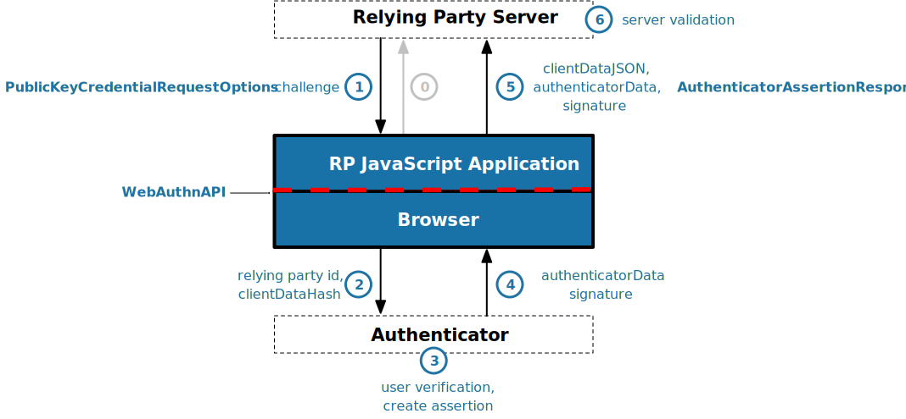

## Yubico FIDO2-Webauthn Demo

> 官网：https://developers.yubico.com/FIDO2/

> 官方github: https://github.com/Yubico/java-webauthn-server

### FIDO2/WebAuthn 优点

+ 全安性强：基于硬件公钥加密，防止网络钓鱼，会话劫持，中间人和恶意软件攻击

+ 隐私保护：FIDO2 身份验证器为每个服务生成一对新密钥，服务器存储公钥。这种方式防止了供应商之间共享问题。

+ 多种选择：开放式标准提供灵活性和产品选择。专为现有手机和计算机设计。使用于多种身份验证模式，以及不同的通信方式（USB，NFC，蓝牙）。

+ 成本: 买一个KEY贵啊！！！

+ 分层方法：对于需要更高级别身份验证安全性的组织，FIDO2支持带有PIN，生物识别或手势的硬件身份验证设备来提供额外保护。

> 测试时使用过 `U2F`, 存在一些问题，在google浏览器上有依赖并且挺强的，新版本中还存在有缺失插件的问题（[u2f-ref-code/u2f-chrome-extension](https://github.com/google/u2f-ref-code/tree/master/u2f-chrome-extension) 已经开始弃用）。并且，官方已经建议使用`WebAuthn-FIDO2`这种方式，并且现在的`WebAuthn`已经是W3C上升为身份验证的WEB标准了，在主流浏览器上都能得到支持。


### 遇到的问题

1. 初始化`RelyingParty`需要注意的点

`RelyingParty` (RP) 是服务端构建，用于生成验证信息和校验签名信息。构造如下例子:

```java
@PostConstruct
public void init() {
    log.info("=======> init service");
    try {
        this.userStorage = new MemoryRegistrationStorage();
        this.registerRequestStorage = newCache();
        this.assertionRequestStorage = newCache();

        RelyingPartyIdentity relyingPartyIdentity = RelyingPartyIdentity.builder()
                .id(RELY_PART_ID)
                .name(RELY_PART_NAME)
                .build();
        // 注意需要注入可信任来源信息
        Set<String> origins = new HashSet<>();
        origins.add("https://localhost-test.com");

        /*
            * 注意name是必需的, id(RelyingPartyIdentity)属性必须等于客户端看到的原始域，或者origin必须是id的子域。如果省略id，则使用originins有效域。
            */
        rp = RelyingParty.builder()
                .identity(relyingPartyIdentity)
                .credentialRepository(this.userStorage)
                .appId(new AppId(APP_ID))
                .validateSignatureCounter(true)
                .origins(origins)
                .build();
        log.info("======> init RelyingParty :{}", rp);
    }catch (Exception e) {
        log.error("init error ", e);
    }
}
```
+ RelyingPartyIdentity: 需要`id`和`name`, **`id`需要与源域名一致，否则无法注册和验证，如：`https://localhost-test.com`的域名下，id的值需要是:`localhost-test.com`**，`name`可以自定义，验签时也会验证。

+ credentialRepository: 属性是获取用户公钥和userHandler等一些校验信息，需要实现`CredentialRepository`接口，方便RP获取到用户的`publicKey`和`userHandler`等。

+ appId: 与域名保持一致，生成公钥等相信会绑定。

+ validateSignatureCounter：参数用于设置是否需要校验公钥验证成功的次数，存储的值需要比验证时上传的签名中解析出来的值小，防止同一个`authentication`使用多次验。

+ origins: 设置可信赖的域，主要设置为对应的验证域名，生成公钥信息时会校验。

> Note: 在本地跑测试的时候，使用`http`的方式时不行的，会在前端生成校验信息时会出现`SECURITY_ERROR`的问题，必须要用`https`的方式，使用有效证书。

2. 开始注册申请

开始注册时，需要先根据`username`创建一些对应的校验信息返回给前端: `PublicKeyCredentialCreationOptions`， 可以设定对应的`displayname`。

```java
UserIdentity identity = UserEntry.generateUserIdentity(username, credentialNickname);
StartRegistrationOptions options = StartRegistrationOptions.builder()
        .user(identity)
        .authenticatorSelection(AuthenticatorSelectionCriteria.builder().requireResidentKey(false).build())
        .build();
PublicKeyCredentialCreationOptions creationOptions = rp.startRegistration(options);
```

3. 完成注册验证

根据开始注册的请求返回的信息，Client会通过具体方法生成对应的`credential`, 这个信息中包含了验签需要的信息。

```java
RegistrationResult registrationResult = rp.finishRegistration(FinishRegistrationOptions.builder()
    .request(registrationResponse.getPublicKeyCredentialCreationOptions())
    .response(request.getCredential())
    .build());
```

`finishRegistration()` 方法如果验证成功，则返回对应的验证信息，如果验证失败，会抛出对应的异常信息。`registrationResult` 中包含了`publicKey`和`credentialId`等信息。

4. 开始验证申请

只需要根据`username`通过RP生成对应的`publicKeyCredentialRequestOptions`返回给Client端，在javaScript中调用对应的方法实现私钥签名。

```java
AssertionRequest request = rp.startAssertion(
        StartAssertionOptions.builder()
            .username(username).build()
);
PublicKeyCredentialRequestOptions options = request.getPublicKeyCredentialRequestOptions()
```

5. 结束验证申请

需要根据开始验证申请中生成的`PublicKeyCredentialRequestOptions`和Client端上传的经过私钥签名的信息`PublicKeyCredential`进行验签，

```java
FinishAssertionOptions finishAssertionOptions = FinishAssertionOptions.builder()
    .request(startResponse.getRequest())
    .response(credential)
    .build();
```

`finishAssertionOptions` 通过 `isSuccess()`方法判断是否验签成功。

> Note: **这里有个坑:** 在google浏览器生成的`credential`信息中，获取到的`userHandler`是空字符串`""`, 这个信息在序列化后对应的`ByteArray`是存在的，但是长度是0，这时候与用户注册时生成的`userHandler`比较的时候会出现不一致的问题导致验签失败。而火狐或者Microsoft Edge 私钥签名时生成的`userHandler`时null,这种在序列化到`ByteArray`的时候是空的，`Optional.empty()`, 这个是空值是，校验时会根据获取注册时生产的`userHadler`做比较，这时候时能验证成功的。这个问题在官方的`github`上也描述的，这个是google浏览器的一个bug，官方描述中不做修复，需要自己实现适配这个问题, 参考: https://github.com/Yubico/java-webauthn-server/issues/12

Server端做适配的解决方案: 判断是否存在，如果存在，并且为空串，直接设置为`Optional.empty()`

```java
PublicKeyCredential<AuthenticatorAssertionResponse, ClientAssertionExtensionOutputs> credential = assertionFinishRequest.getCredential();
Optional<ByteArray> userHandler = credential.getResponse().getUserHandle();
if (userHandler.isPresent() && userHandler.get().isEmpty()) {
    AuthenticatorAssertionResponse authenticatorAssertionResponse = credential.getResponse().toBuilder().userHandle(Optional.empty()).build();
    credential = credential.toBuilder().response(authenticatorAssertionResponse).build();
}
```

### 工作流程和原理

下面的流程图是 FIDO2/WebAuthn 的流程:


### WebAuthn Registration

1. 指定别名，通过Server端先初始化chanllenge, userInfo, relyingPartyInfo, 返回给Client, Client 在用户同意下，RP可以通过客户端创建新凭证，在浏览器中，这是通过调用`navigator.credentials.create()` 方法实现创建新凭证，它将`PublicKeyCredentialCreationOptions ` 作为参数并返回 `PublicKeyCredential`。将凭证添加到用户账户之前，RP会验证`PublicKeyCredential`。


#### PublicKeyCredentialCreationOptions

> Note: 在WebAuthn API 中，所有二进制参数实际上是`UintArrays`而不是Base64字符串，此示例将它们显示为Base64字符串提高可读性。

```json
{
  "publicKey": {
    "attestation": "direct",
    "authenticatorSelection": {
      "authenticatorAttachment": "cross-platform",
      "requireResidentKey": false,
      "userVerification": "discouraged"
    },
    "challenge": "qNqrdXUrk5S7dCM1MAYH3qSVDXznb-6prQoGqiACR10=",
    "excludeCredentials": [],
    "pubKeyCredParams": [
      {
        "alg": -7,
        "type": "public-key"
      }
    ],
    "rp": {
      "id": "demo.yubico.com",
      "name": "Yubico Demo"
    },
    "timeout": 30000,
    "user": {
      "displayName": "Yubico demo user",
      "id": "bz9ZDfHzOBLycqISTAdWwWIZt8VO-6mT3hBNXS5jwmY="
    }
  }
}
```

> RP: RelyingParty，在Server端过构建的验证器。

+ attestation： 

    1. none: The default value is “none” which means the RP is not interested in authenticator attestation.

    2. indirect: The RP prefers a verifiable attestation statement but allows the client to decide how to obtain it.

    3. direct：indicates the RP wants to receive the attestation statement. 

    > It is recommended that RPs use the “direct” value and store the attestation statement with the credential so they can inspect authenticator models retroactively if policy changes.

+ authenticatorSelection:  specify authenticator requirements. The optional authenticatorAttachment attribute filters eligible authenticator by type. The value “platform” indicates a platform authenticator, such as Windows Hello. The value "cross-platform" value indicates a roaming authenticator, such as a security key. When the requireResidentKey attribute is true, the authenticator must create a client side resident private key (a.k.a. resident credential). The userVerification attribute can be set to a value of “preferred”, “required”, or “discouraged”.

+ challenge: In order to prevent replay attacks, the value should be randomly generated by the RP.

+ excludeCredentials: limits creation of multiple credentials for the same account on a single authenticator. If the authenticator finds an existing credential type and id for the RP, then a new credential will not be created.

+ pubKeyCredParams: Specifies which cryptographic algorithms the RP supports. type: only one type: “public-key”. alg: cryptographic signature algorithm preference specified by COSE Algorithms registry. If you use a library to validate authenticator responses, pubKeyCredParams is probably determined by what the library suppports.

+ rp: relying party information. name is required. ***The id attribute must equal the domain of the origin seen by the client, or the origin must be a subdomain of the id. If id is omitted, then origins effective domain is used.***

    > Note: 这里的`name` 和 `ID` 在Server端构建`RelyingParty`的时候，指定的 name 可以自定义，但是 `ID` 必须与请求的原始域(域名)一致，否则无法注册。也需要在构建`RelyingParty`的时候，指定可信任的域`origins`。

+ timeout: the time, in milliseconds, that the caller is willing to wait for the call to complete.

+ user: contains data about the user account.  The `displayName` provides a user-friendly name which may be displayed to the user. The `name` attribute takes a traditional username or the like, to disambiguate accounts with similar `displayNames`. The `id` attribute is the user handle that is generated by the RP and used to uniquely identify a user. Unlike `name`, `id` is not meant to be human-readable and should not contain personally identifying information such as an e-mail address.


#### PublicKeyCredential

Client javaScript 通过调用 `navigator.credentials.create()`, 浏览器会根据原点验证`rp.id`, 散列`clientData`， 并调用`authenticatorMakeCredential`方法。在继续之前，验证者将要求获得某种形式的用户同意，验证者同意后，验证者将创建新的非对称密钥对并安全地存储私钥。公钥成为证明的一部分，证明者使用证明私钥进行签名。还可以返回制造商的证明书链，以便依赖方可以将设备验证回信根。(Before proceeding, the authenticator will ask for some form of user consent. After verifying consent, the authenticator will create a new asymmetric key pair and safely store the private key. The public key becomes part of the attestation, which the authenticator signs over with the attestation private key. The manufacturer’s attestation certificate chain may also be returned so that the relying party can validate the device back to a root of trust.)

新的公钥，凭证ID和其他证明数据将返回到浏览器，封装成为`attestationObject`， `navigator.credentials.create()` Promise 解析并返回 `PublicKeyCredential`，把这个集上传到Server端使RP完成注册。

`PublicKeyCredential` 格式如下:

```json
{
  "id": "X9FrwMfmzj...",
  "response": {
    "attestationObject": "o2NmbXRoZmlk...",
    "clientDataJSON": "eyJjaGFsbGVuZ..."
  },
  "clientExtensionResults": {}
}
```

+ id: The credential identifier.

+ response: contains the credential public key, and metadata which can be used the RP to assess the characteristics of the credential. The `attestationObject` contains the authenticator data and attestation statement. The `clientDataJSON` contains the JSON-serialized data passed to the authenticator by the client in order to generate the credential.

+ clientExtensionResults(): method returns values for zero or more WebAuthn extensions.

`Attestation Object` 内容结构：


`attestationObject` 格式内容如下：

> Note: In the WebAuthn API, the attestationObject is actually an ArrayBuffer. This example displays it in Base64 for readability

```json
{
    "attStmt": {
      "alg": -7,
      "sig": "MEUCIQD1...",
      "x5c": [
        "MIICvDCCA..."
      ]
    },
    "authData": {
      "credentialData": {
        "aaguid": "-iuZ3J45QlePkkow0jxBGA==",
        "credentialId": "X9FrwMfmzj...",
        "publicKey": {
          "1": 2,
          "3": -7,
          "-1": 1,
          "-2": "ZsGUIeG53MifPb72qqnmC-X-0PLO-bZiNNow3LUHUYo=",
          "-3": "kuBFf3ZcUc-LAFTPIB8e5DaDt2ofJQ3wAB16zHqNUX0="
        }
      },
      "flags": {
        "AT": true,
        "ED": false,
        "UP": true,
        "UV": false
      },
      "rpIdHash": "xGzvgq0bVGR3WR0Aiwh1nsPm0uy085R0v-ppaZJdA7c=",
      "signatureCounter": 7
    },
    "fmt": "packed"
}
```

+ attStmt: The attestation statement is a signed data object containing statements about the public key credential itself and the authenticator that created it. This example uses the “packed” attestation statement format. The alg field contains the COSE Algorithm identifier. The sig field contains the attestation signature. The x5c field contains the attestation certificate and its certificate chain. Use the certificate chain to verify the device is genuine.

+ authData: The authenticator data is a byte array containing data about the make credential operation, including the credential ID and public key.

+ credentialData: the credential data attested by the authenticator.

+ aaguid: An identifier chosen by the authenticator manufacturer, indicating the make and model of the authenticator. Note: some authenticators (including all U2F authenticators) don’t support this, and set the aaguid to 16 zero bytes.

+ credentialId: The credential identifier generated by the authenticator.

+ publicKey: The credential public key encoded in COSE_Key format. The example is a COSE_Key Elliptic Curve public key in EC2 format.

    **1**: is the key type. A value of 2 is the EC2 type
    
    **3**: is the signature algorithm. A value of -7 is the ES256 signature algorithm
    
    **-1**: is the curve type. A value of 1 is the P-256 curve
    
    **-2**: is the x-coordinate as byte string

    **-3**: is the y-coordinate as byte string

+ flags: The AT indicates whether the authenticator added attested credential data, and is always 1 for registrations. The ED flag indicates if the authenticator data has extensions. The UP flag indicates if the user is present. The UV flag indicates if the user is verified (PIN or biometric).

+ rpIdHash: a SHA-256 hash of the RP ID the credential is scoped to.

+ signatureCounter: is incremented for each successful authenticatorGetAssertion operation. It is used by RPs to aid in detecting cloned authenticators.

+ fmt: The attestation statement format identifier. The format could be one of the defined attestation formats detailed in the W3C WebAuthn spec, e.g. packed, fido-u2f format, etc…

`clientDataJSON` 

> Note: In the WebAuthn API, the clientDataJSON is actually an ArrayBuffer. This example displays it in Base64 for readability

```json
{
  "challenge": "qNqrdXUrk5S7dCM1MAYH3qSVDXznb-6prQoGqiACR10",
  "origin": "https://demo.yubico.com",
  "type": "webauthn.create"
}
```

The `clientDataJSON` object contains the `challenge` sent by the RP, the `origin` of the domain observed by the client, and the `type` of operation performed.

Server RP 对这些信息进行检查以确保信息不被篡改，验证包含：

+ Verifying the signature over the `clientDataHash` and the `attestation` using the certificate chain in the attestation statement

+ Optionally: verifying that the certificate chain is signed by a trusted certificate authority of the RP’s choice.


### WebAuthn Authentication

Server RP 可以请求用户使用现有凭证执行身份验证操作的权限。身份验证流程与注册流程类似。主要区别是：

+ 身份验证不需要用户信息

+ 身份验证创建由先前生成的依赖方关联的私钥签名来断言，而不是使用证明证书进行签名。(Authentication creates an assertion signed by the previously generated private key that is associated with the relying party rather than signing with the attestation certificate.)

流程如下：



1. 客户端发起代表用户进行身份验证的请求。

2. Server RP 构建 `PublicKeyCredentialRequestOptions` 实例并且返回给客户端。它包含了 `challenge` 和 `allowCredentials` 字段信息，其中包含可用于执行身份验证仪式的先前注册的凭据列表。

`PublicKeyCredentialRequestOptions` 格式：

> In the WebAuthn API, all binary parameters (id, challenge etc.) are actually Uint8Arrays and not Base64 strings. This example displays them as Base64 strings for readability

```json
{
  "publicKey": {
    "allowCredentials": [
      {
        "id": "X9FrwMfmzj...",
        "type": "public-key"
      }
    ],
    "challenge": "kYhXBWX0HO5GstIS02yPJVhiZ0jZLH7PpC4tzJI-ZcA=",
    "rpId": "demo.yubico.com",
    "timeout": 30000,
    "userVerification": "discouraged"
  }
}
```

+ allowCredentials: list of public key credentials acceptable to the RP. Credentials can be omitted in username-less authentication scenario. An entry includes the type of the credential and credential id, and optionally a list of `transports` the client can use to find the credential.

+ challenge: contains a random value generated by the RP from the authenticator to sign as part of the authentication assertion.

+ rpId: `relying party identifier` claimed by the caller. ***This must exactly match the rp.id specified during registration.***

+ timeout: the time, in milliseconds, that the caller is willing to wait for the call to complete.

+ userVerification: The default value is “preferred”. If “required”, the client will only use an authenticator capable of user verification. If "preferred", the client will use an authenticator capable of user verification if possible. If "discouraged", the authenticator is not asked to perform user verification but may do so at its discretion.

3. Client 端的javaScript 获取到这些信息后，调用 `navigator.credentials.get()`, 浏览器根据原点验证 `rp.id`, 散列 clientData， 并且调用 `authenticatorGetAssertion`方法。

4. 验证者找到对应的`Relying Party ID`, 并且提示用户同意进行身份验证。如果步骤成功，验证者将通过注册期间为该账户生成的私钥对`clientDataHash`和`authenticatorData`进行签名来创建新的验证信息。(The authenticator finds a credential that matches the Relying Party ID and prompts the user to consent to the authentication. Assuming the steps are successful, the authenticator creates a new assertion by signing over the clientDataHash and authenticatorData with the private key generated for this account during registration.)

5. 验证器将`authenticatorData` 和 `assertion signature` 返回给浏览器.

6. 浏览器将Promise解析为包含`AuthenticatorAssertionResponse`的`PublicKeyCredential`，然后返回到Server RP以完成身份验证。

`PublicKeyCredential` 格式信息：

> Note: In the WebAuthn API, all binary parameters (id, authenticatorData etc.) are actually of type ArrayBuffer and not Base64 strings. This example displays them as Base64 strings for readability.

```json
{
  "id": "X9FrwMfmzj...",
  "response": {
    "authenticatorData": "xGzvgq0bVGR3WR0Aiwh1nsPm0uy085R0v-ppaZJdA7cBAAAACA",
    "clientDataJSON": "eyJjaGFsbG...",
    "signature": "MEUCIQDNrG..."
  },
  "clientExtensionResults": {}
}
```

+ id: The credential identifier.

+ response: contains the metadata the RP needs to validate the assertion. The `authenticatorData` contains the authenticator data. The `clientDataJSON` contains the JSON-serialized data passed to the authenticator by the client in order to generate the credential. The signature contains the raw signature returned from the authenticator.

+ clientExtensionResults(): method returns values for zero or more WebAuthn extensions.

`authenticatorData` 格式：

```json
{
    "authData": {
      "flags": {
        "AT": false,
        "ED": false,
        "UP": true,
        "UV": false
      },
      "rpIdHash": "xGzvgq0bVGR3WR0Aiwh1nsPm0uy085R0v-ppaZJdA7c=",
      "signatureCounter": 8
}
```
+ authData: The authenticator data is a byte array containing data about the get credential operation, including a signature counter and a hash of the RP ID.

+ flags: The `AT` indicates whether the authenticator added attested credential data, and is always 0 in assertions. The `ED` flag indicates if the authenticator data has extensions. The `UP` flag indicates if the user is present. The `UV` flag indicates if the user is verified (PIN or Biometric).

+ rpIdHash: a SHA-256 hash of the RP ID the credential is scoped to.

+ signatureCounter: is incremented for each successful authenticatorGetAssertion operation. It is used by RPs to aid in detecting cloned authenticators.

`clientDataJSON` 格式

```json
{
  "challenge": "kYhXBWX0HO5GstIS02yPJVhiZ0jZLH7PpC4tzJI-ZcA",
  "origin": "https://demo.yubico.com",
  "type": "webauthn.get"
}
```

The `clientDataJSON` object contains the `challenge` sent by the RP, the `origin` of the domain observed by the client, and the `type` of operation performed.

7. 把收到的验证信息发送到Server端进行验证:

+ Verifying the authenticator’s signature using the public key that was stored during the registration request

+ Verifying that the challenge signed by the authenticator matches the challenge that was generated by the server

+ Verifying that the relying party ID is the expected value

